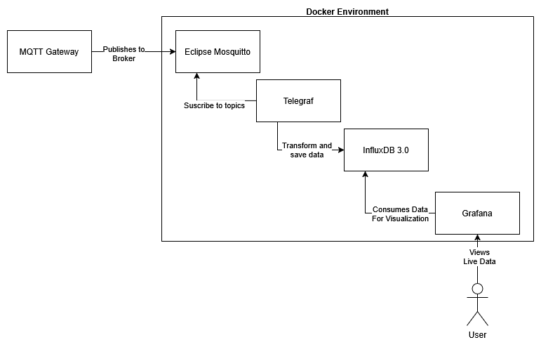
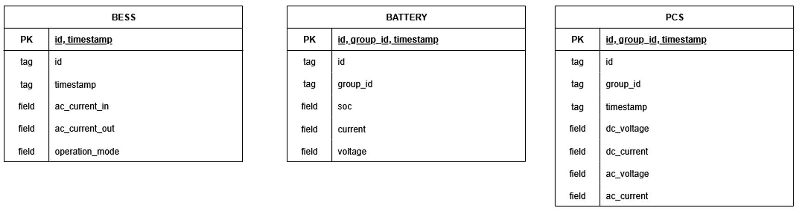

# BESS Telemetry Data Pipeline

This repository contains a docker compose enviroment, configuration files and scripts to setup a telemetry data pipeline. 


## 1. Data lifecycle

**Diagram of Data Pipeline**



This diagram shows how the services in the environment work together to recieve data via the MQTT protocol, transform it to the format needed for time series storage, and then consumed by a dashboard for visualization.

### 1.1 Data Extraction

The BESS hardware has data aquiscition software that collects data from its different sources, like batteries, power conversion systems or sensors. This data is then broadcasted using the MQTT protocol via a module that serves as an MQTT Gateway which publishes to Eclipse Mosquitto an MQTT broker.

The broker handles publishing and suscribing to MQTT topics containing data. For example, the status of a battery can be accesed via the topic ```"/batteries/1/status"``` where ```1``` is the id of the battery. The output is transfered via json and recieved by telegraf via it's ```inputs.mqtt_consumer"``` plugin.

### 1.2 Data Transformation

The telegraf service uses input and output plugins to serve as an I/O gateway and data transformation service. It also provides data processing plugins which are not being used at the moment. This plugins can be configured via the ```./telegraf/telegraf.conf``` file. The MQTT consumer plugin is used to suscribe to the status topics of the components, and then mapped to tags (identifying data) or fields (telemetry data) before loading into the database.

### 1.3 Data Storage

Telegraf then uses the ```outputs.influxdb_v2``` plugin to connect to the time series database. InfluxDB3 has been setup for this. Note that the version of the plugin corresponds to InfluxDB 2, but InfluxDB 3 provides a compatibility layer, and it was chosen for long time support. The data is saved in the database in the following format:



InfluxDB has adopted a model of tables for measurements, to logically group the data. Tags are used to identify data and their source.

### 1.4 Data Visualization

To end the pipeline Grafana was setup for visualization. This service allows the administrator of the system to setup data sources, and then create visualization dashboards for system monitoring. This configuration as of now has to be done manually. The dashboard is provided via a json file exported by grafana and that can be imported on your system.

## 2. Setup

### 2.1 Structure

This repository consists of a docker compose file to setup the services, and configuration files for this services. Also it contains scripts that will setup the environment.

> **Important Note** all scripts should be run with ```sudo```, since they will setup dependencies and create directories, setup permissions and run commands to automate the setup process.

### 2.2 Clone this repo

Choose a directory in which you will host the files. This pipeline works independently, but it's intended to work alongside the [BESS Telemetry Interface](https://github.com/Dani-2TB/BESS-TelemetryInterface). Once you are in your desired directory, clone the repo with:

``` bash
git clone https://github.com/Dani-2TB/BESS-Docker-Environment
```

If you are a contributor and have setup your ssh key, you can also use

``` bash
git clone git@github.com:Dani-2TB/BESS-Docker-Environment.git
```

Once cloned cd into the repo

```bash
cd BESS-Telemetry-Interface
```

### 2.3 Review Dependencies

If you have not done so already, install the docker engine on your environment. If you are testing directly on a Raspberry Pi, you can use the provided script ```setup_raspi_env.sh``` this will install dependencies for you. But keep in mind that this is intended to setup the entire system, if you wish to just test this services and/or the Configuration Interface you can just install docker following the [official documentation](https://docs.docker.com/engine/install/) for your system.

Troubleshooting docker installations are outside the scope of this documentation.

### 2.4 Start the services

To finish setting up the services and have them running you can first review the ```setup_services.sh``` script. Be sure it's allowed to execute, if it's not allow it with:

```bash
chmod +x setup_services.sh
```

This script will:

1. Create the persistent InfluxDB 3 directories and give them the proper permissions, for both core (the database proper) and explorer (the administration interface)
2. Generate a secret key for session persistance on the administration interface and store it in a .env file
3. Start ```influxdb3-core``` service and generate an admin token which will be stored in the generated .env
4. Setup the ```influxdb3-explorer``` configuration file with the generated admin key for influxdb
5. Start all other services

You can execute the script with:

```bash
sudo ./setup_services.sh
```

After the script finishes executing the pipeline should be fully ready.

### 2.5 Setup Grafana

Grafana needs to be configured manually. Follow the [grafana documentation](https://grafana.com/docs/grafana/latest/setup-grafana/configure-grafana/) to setup a new data source pointing to the influxdb3 server ```http://influxdb3-core:8181``` and then import the dashboard with the included json file.